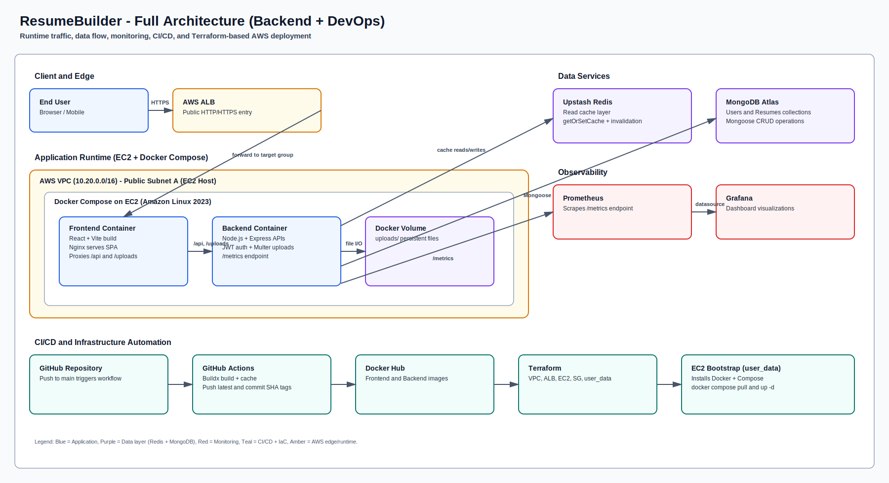
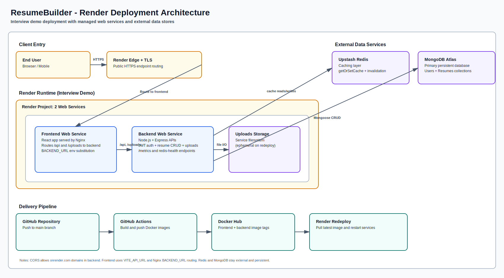

# ResumeBuilder

Production-grade resume builder built with a modern MERN architecture, containerized delivery, infrastructure automation, and observability-first operations.


<p align="left">
  
</p>

## Table of Contents

1. Project Summary
2. Architecture Diagram
3. Key Features
4. Tech Stack
5. Backend Implementation Details
6. DevOps Implementation Details
7. Repository Structure
8. Local Development
9. Monitoring
10. AWS Deployment (Terraform)
11. What You Built (Backend + DevOps Highlight)
12. License
13. Author

## Project Summary

ResumeBuilder helps users create, edit, customize, and export professional resumes through a responsive web application.

What this project demonstrates clearly:

- End-to-end full-stack engineering with React + Node.js + MongoDB
- Secure backend design with JWT auth, password hashing, and protected APIs
- Redis-based read caching and cache invalidation patterns
- Dockerized app delivery with Nginx reverse proxy integration
- Monitoring setup with Prometheus metrics and Grafana dashboards
- CI pipeline that builds and pushes versioned images to Docker Hub
- Infrastructure as Code using Terraform for AWS EC2 + ALB deployment

## Architecture Diagram

The architecture is shown below as a static SVG to ensure consistent rendering on GitHub, VS Code, and markdown preview tools.



Backend and DevOps emphasis in this architecture:

- Redis is a first-class component in the data path, used for cached reads and explicit invalidation.
- CI/CD and infrastructure automation are shown together, from GitHub push to Docker image distribution and EC2 runtime bootstrap.

## Render Deployment Architecture (Interview Demo)

This diagram focuses on the deployment setup used for live interview showcase on Render.



### Render Notes

- Frontend and backend run as separate Render web services.
- Frontend uses Nginx to proxy `/api` and `/uploads` to backend.
- Backend CORS allows `.onrender.com` origins.
- MongoDB Atlas and Upstash Redis remain external managed services.
- CI image pipeline remains GitHub Actions -> Docker Hub -> Render redeploy.

### Architecture Notes

- External user traffic enters through AWS Application Load Balancer.
- Frontend container serves the SPA and proxies API/upload traffic to backend.
- Backend persists business data in MongoDB Atlas and caches reads in Upstash Redis.
- Prometheus scrapes backend metrics from `/metrics`, and Grafana visualizes time-series data.
- GitHub Actions builds and pushes container images to Docker Hub on each push to `main`.
- Terraform provisions the VPC, subnets, ALB, EC2 host, and security groups for deployment.

## Key Features

- User registration and login with JWT-based authentication
- Protected resume CRUD APIs per authenticated user
- Resume template editing flow with live preview support
- Upload and replace resume thumbnail and profile image
- Resume dashboard with progress/completion insights
- PDF export capabilities in frontend stack
- Metrics endpoint and monitoring dashboards
- Docker-first local and cloud deployment workflow

## Tech Stack

### Frontend

- React 19
- Vite
- React Router
- Axios
- Tailwind CSS
- Nginx (production static serving and API proxy)

### Backend

- Node.js 20
- Express 5
- MongoDB + Mongoose
- JWT + bcryptjs
- Multer (image uploads)
- ioredis (Upstash Redis)
- prom-client (Prometheus metrics)

### DevOps & Platform

- Docker + Docker Compose
- GitHub Actions
- Docker Hub registry
- Terraform (AWS EC2 + ALB + networking)
- Prometheus + Grafana observability stack

## Backend Implementation Details

This project has a strong backend focus with production-oriented patterns.

### API Surface

Auth routes:

- `POST /api/auth/register`
- `POST /api/auth/login`
- `GET /api/auth/profile` (protected)

Resume routes (all protected):

- `POST /api/resume`
- `GET /api/resume`
- `GET /api/resume/:id`
- `PUT /api/resume/:id`
- `PUT /api/resume/:id/upload-images`
- `DELETE /api/resume/:id`

Operational routes:

- `GET /metrics` (Prometheus scrape endpoint)
- `GET /api/redis-health` (cache connectivity check)

### Security and Access Control

- Passwords are hashed with `bcryptjs`
- JWT token is issued on login/register
- Protected routes validate `Authorization: Bearer <token>`
- CORS is environment-aware:
  - Explicit allowlist from `ALLOWED_ORIGINS`
  - Dynamic support for Codespaces and Render domains

### Data and Caching Strategy

- MongoDB stores users and resume documents
- Upstash Redis stores cached read payloads and reduces repeated database reads
- `getOrSetCache` is used for profile and resume reads
- Cache keys are invalidated on create/update/delete write operations
- Redis failures gracefully fall back to database fetches

### Redis Caching Layer (Highlighted)

- Redis is used in user profile and resume retrieval paths to improve API responsiveness.
- Cache TTL is controlled at the key level (`300s` default, custom TTL where needed).
- Write operations invalidate affected keys to avoid stale reads.
- The backend includes a dedicated health endpoint (`/api/redis-health`) for connectivity verification.

### File Upload Pipeline

- Multer disk storage writes to `backend/uploads`
- Allowed mime types: jpeg, jpg, png
- Existing thumbnail/profile files are cleaned up on replacement
- Uploaded assets are served via `/uploads`

### Observability in Backend

- `prom-client` default runtime metrics are enabled
- HTTP request counter, latency histogram, and in-progress gauge are instrumented
- Business and error metric definitions are prepared for extension

## DevOps Implementation Details

This repository goes beyond app code and includes practical DevOps automation.

### Containerization

- Backend and frontend use multi-stage Dockerfiles
- Frontend image starts Nginx with runtime `BACKEND_URL` substitution
- Health checks are configured for frontend and backend containers

### Docker Compose Stack

Root `docker-compose.yml` orchestrates:

- `backend` on port 4000
- `frontend` on port 80
- `prometheus` on port 9090
- `grafana` on port 3000

Also includes:

- Persistent volumes for Prometheus and Grafana data
- Shared bridge networking for service communication

### CI/CD Pipeline

GitHub Actions workflow (`.github/workflows/docker-build-push.yml`):

- Triggers on push to `main`
- Builds backend and frontend images with Buildx
- Pushes both `latest` and `<short-commit-sha>` tags
- Uses Docker layer cache to speed up subsequent builds

### Infrastructure as Code (AWS)

Terraform stack under `infra/ec2-compose-alb` provisions:

- VPC and public subnets
- Internet Gateway and public route table
- Security groups for ALB and EC2
- Application Load Balancer with HTTP/HTTPS listener logic
- EC2 host running Docker Compose
- User data bootstrap script that installs Docker and starts containers

Deployment flow:

1. CI pushes images to Docker Hub
2. EC2 host pulls latest images via Docker Compose
3. ALB routes public traffic to frontend on EC2
4. Frontend proxies API and upload paths to backend container

## Repository Structure

```text
.
├── backend/                  # Express API, models, controllers, middleware
├── frontend/                 # React app (Vite) and Nginx config
├── grafana/                  # Dashboards and provisioning
├── prometheus/               # Prometheus scrape config
├── infra/
│   └── ec2-compose-alb/      # Terraform for AWS demo deployment
├── .github/workflows/        # CI pipeline (Docker build/push)
└── docker-compose.yml        # Local full-stack + monitoring orchestration
```

## Local Development

### Prerequisites

- Node.js 20+
- npm
- Docker + Docker Compose (recommended)
- MongoDB Atlas connection string
- Upstash Redis URL

### Environment Variables

Create `backend/.env`:

```env
MONGO_URI=mongodb+srv://<user>:<password>@<cluster>/<db>
REDIS_URL=rediss://default:<password>@<host>:<port>
JWT_SECRET=replace_with_secure_secret
ALLOWED_ORIGINS=http://localhost:5173,http://localhost:5174
NODE_ENV=development
PORT=4000
```

### Run Without Docker

Backend:

```bash
cd backend
npm install
npm run dev
```

Frontend:

```bash
cd frontend
npm install
npm run dev
```

### Run With Docker Compose (App + Monitoring)

```bash
docker-compose up -d --build
```

Service URLs:

- Frontend: `http://localhost`
- Backend: `http://localhost:4000`
- Prometheus: `http://localhost:9090`
- Grafana: `http://localhost:3000` (`admin/admin`)

Stop stack:

```bash
docker-compose down
```

## Monitoring

- Backend exposes metrics at `GET /metrics`
- Prometheus scrapes backend metrics every 10 seconds
- Grafana ships with pre-provisioned dashboard configuration

Useful checks:

```bash
curl http://localhost:4000/metrics
docker-compose ps
docker-compose logs -f backend
```

## AWS Deployment (Terraform)

The repository includes a deployment option designed for demo/showcase usage.

```bash
cd infra/ec2-compose-alb
cp terraform.tfvars.example terraform.tfvars
# Fill in real values for key_name, mongo_uri, redis_url, jwt_secret, etc.

terraform init
terraform plan
terraform apply
```

Outputs include:

- ALB DNS name
- App URL
- EC2 public IP

Destroy infrastructure:

```bash
terraform destroy
```

## What You Built (Backend + DevOps Highlight)

You implemented a strong production-style foundation:

- Designed a protected API platform (auth + resource ownership)
- Added Redis-assisted read performance and cache invalidation discipline
- Integrated image upload lifecycle handling with cleanup
- Added Prometheus-compatible instrumentation and metrics endpoint
- Containerized both tiers with runtime-configurable reverse proxy behavior
- Automated build and image publishing using GitHub Actions
- Codified AWS networking, ALB routing, and compute bootstrap with Terraform

This is the exact type of implementation depth expected in backend and DevOps-focused full-stack projects.

## License

Licensed under the MIT License. See `LICENSE` for details.

## Author

Santosh Reddy

- GitHub: https://github.com/santoshreddy-1362004
