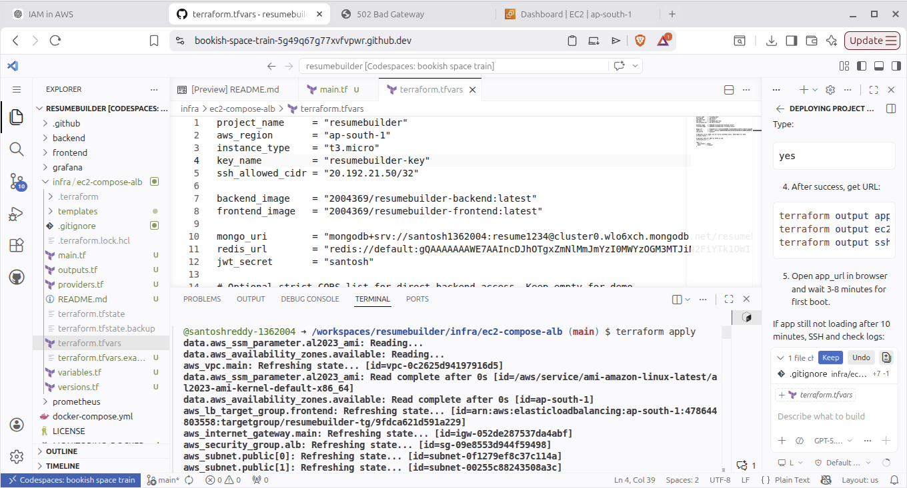
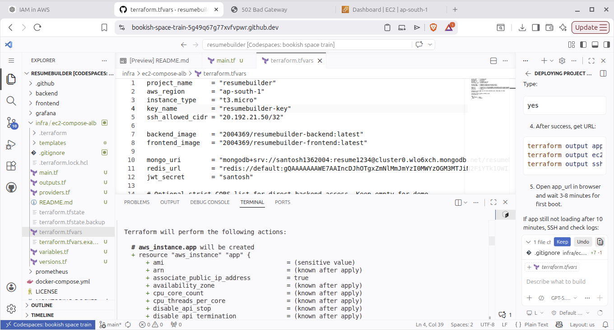
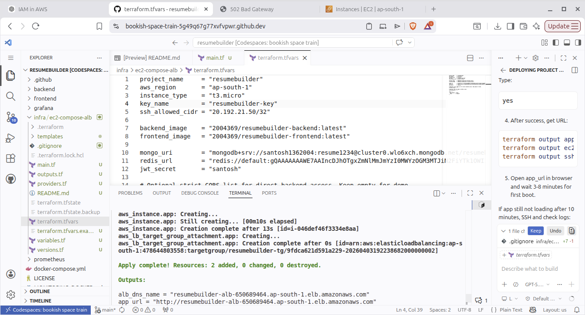
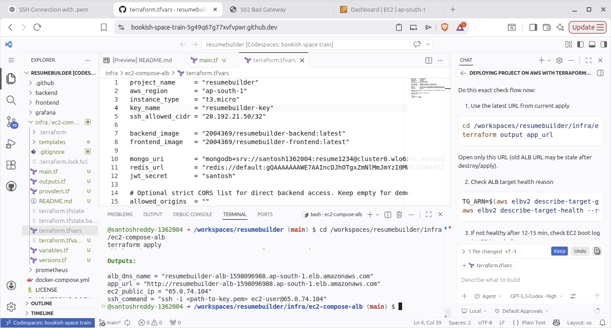
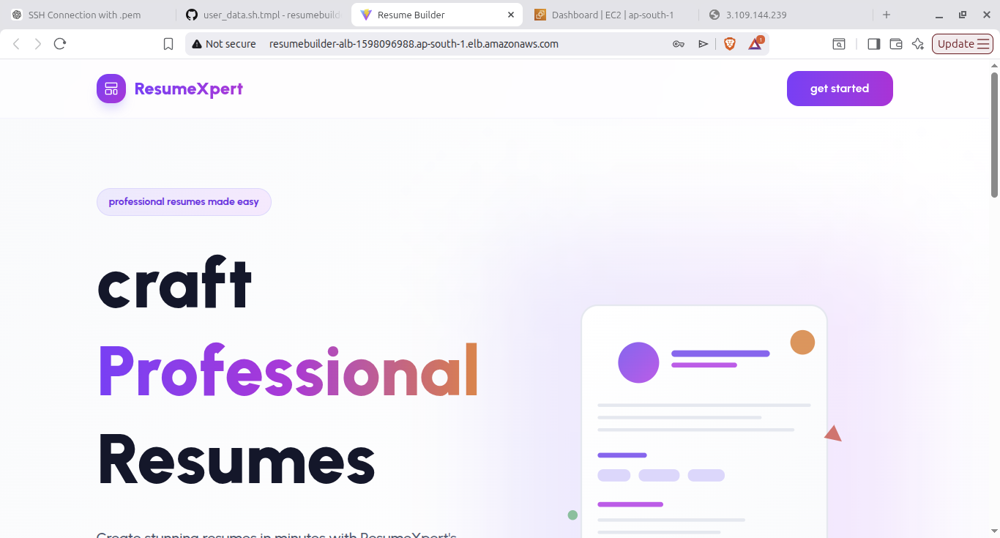
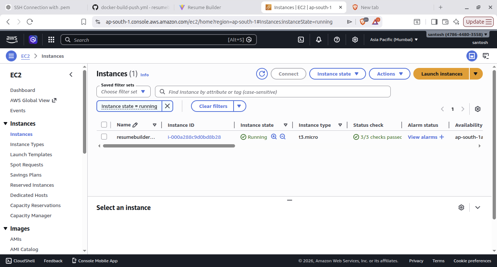

# ResumeBuilder

A production-style resume builder focused on backend quality, containerized delivery, caching, and infrastructure automation.


<p align="left">
  
</p>

## Table of Contents

1. Core Architecture
2. Repository Structure
3. Backend Highlights
4. Docker Build Strategy
5. Docker Compose Stack
6. Redis Caching Design
7. Terraform Infrastructure (AWS)
8. Deployment Proof (Screenshots)
9. Monitoring and Observability
10. Local Setup
11. Render Deployment (Live Demo)
12. License
13. Author

## Core Architecture

Main project architecture (backend + DevOps focus):


## Repository Structure

```text
.
├── backend/                  # Express API, models, controllers, middleware
├── frontend/                 # React app (Vite) + Nginx runtime config
├── docker-compose.yml        # App + monitoring local orchestration
├── prometheus/               # Prometheus configuration
├── grafana/                  # Dashboards and provisioning
├── infra/ec2-compose-alb/    # Terraform for AWS EC2 + ALB stack
├── docs/architecture/        # Architecture SVG diagrams
└── pics/                     # Deployment proof screenshots
```

## Backend Highlights

### API Design

Authentication:

- `POST /api/auth/register`
- `POST /api/auth/login`
- `GET /api/auth/profile` (protected)

Resume domain (protected + user-scoped):

- `POST /api/resume`
- `GET /api/resume`
- `GET /api/resume/:id`
- `PUT /api/resume/:id`
- `PUT /api/resume/:id/upload-images`
- `DELETE /api/resume/:id`

Operational endpoints:

- `GET /metrics`
- `GET /api/redis-health`

### Security and Access Control

- JWT-based auth middleware protects private routes.
- Passwords are hashed with `bcryptjs`.
- CORS is controlled with `ALLOWED_ORIGINS` and includes support for `*.onrender.com`.
- API access is ownership-aware (user can only access their own resumes).

### Data Model and Persistence

- MongoDB Atlas stores users and resume documents.
- Mongoose models support structured nested sections for resume content.
- Upload references are persisted and old files are cleaned up on replacement/delete.

### Upload and Asset Handling

- Multer handles image uploads (jpeg/jpg/png).
- `uploads` is served as a static path from backend.
- Thumbnail and profile images are replaced safely with cleanup.

## Docker Build Strategy

### Backend Container

- Multi-stage Dockerfile on Node 20 Alpine.
- App runs as a lightweight runtime image.
- Health check targets `/metrics` for process + API readiness.

### Frontend Container

- React app is built in a builder stage.
- Nginx serves static assets in runtime stage.
- `BACKEND_URL` is injected at startup via `envsubst`.
- Nginx proxies `/api` and `/uploads` to backend.

### Image Size Reduction with Multi-Stage Builds

The Dockerfiles use multi-stage builds to significantly reduce final runtime image size.

| Service | Before | After | Reduction |
|---------|--------|-------|-----------|
| Backend | 1.2 GB | 313 MB | 74% |
| Frontend | 900 MB | 64 MB | 93% |

This improves pull time, deploy speed, and registry storage efficiency.

## Docker Compose Stack

The root compose file runs a full local environment:

- `backend` (port 4000)
- `frontend` (port 80)
- `prometheus` (port 9090)
- `grafana` (port 3000)

What this gives you:

- One command local stack bring-up
- Shared network between services
- Persistent volumes for monitoring data
- Health checks for app services

## Redis Caching Design

Redis is intentionally a first-class layer in this project.

- Upstash Redis is used for read-heavy API paths.
- `getOrSetCache` wraps fetch logic for profile and resume retrieval.
- Cache invalidation is triggered after create/update/delete operations.
- If Redis is unavailable, backend gracefully falls back to MongoDB.
- Dedicated endpoint `/api/redis-health` helps validate runtime cache connectivity.

## Terraform Infrastructure (AWS)

Infrastructure code is under `infra/ec2-compose-alb`.

Provisioned resources:

- VPC and public subnets
- Internet gateway + route table
- ALB + target group + listeners (HTTP/HTTPS)
- EC2 instance running Docker Compose
- Security groups for ALB and EC2
- User data bootstrap for Docker install and service startup

Deployment flow:

1. Push code to main
2. GitHub Actions builds and pushes images to Docker Hub
3. Terraform provisions/updates AWS resources
4. EC2 user data runs Docker Compose pull/up
5. ALB routes public traffic to frontend container

## Deployment Proof (Screenshots)

All proof images are included below in filename order (`pro2` -> `pro9`) so the deployment story is easy to follow during interviews.

### Proof 1 - Terraform Inputs and AWS CLI Setup (`pro2.png`)



### Proof 2 - Terraform Apply Initialization (`pro3.png`)



### Proof 3 - Resource Creation Complete (`pro4.png`)



### Proof 4 - Terraform Outputs and SSH Command (`pro7.png`)



### Proof 5 - Application Reachability Through ALB (`pro8.png`)



### Proof 6 - EC2 Instance Running Status (`pro9.png`)



### Security Note

These screenshots are useful for interview proof, but some frames may contain environment details. Redact sensitive values before public sharing outside interview/demo contexts.

## Monitoring and Observability

- Backend is instrumented using `prom-client`.
- Prometheus scrapes metrics from `/metrics`.
- Grafana dashboards are pre-provisioned from repository config.
- Container health checks are enabled in compose and Dockerfiles.

## Local Setup

### Prerequisites

- Node.js 20+
- npm
- Docker + Docker Compose
- MongoDB Atlas URI
- Upstash Redis URL

### Backend Environment (`backend/.env`)

```env
MONGO_URI=mongodb+srv://<user>:<password>@<cluster>/<db>
REDIS_URL=rediss://default:<password>@<host>:<port>
JWT_SECRET=replace_with_strong_secret
ALLOWED_ORIGINS=http://localhost:5173,http://localhost:5174
NODE_ENV=development
PORT=4000
```

### Run Locally Without Docker

```bash
cd backend && npm install && npm run dev
cd frontend && npm install && npm run dev
```

### Run Full Stack With Docker Compose

```bash
docker-compose up -d --build
```

Service endpoints:

- Frontend: `http://localhost`
- Backend: `http://localhost:4000`
- Prometheus: `http://localhost:9090`
- Grafana: `http://localhost:3000`

Stop services:

```bash
docker-compose down
```

## Render Deployment (Live Demo)

For interviews and live sharing, Render is used as the running demo environment to control cost while keeping architecture credibility.

Render-focused architecture:


Why this setup is practical:

- AWS Terraform stack proves infrastructure depth.
- Render keeps demo hosting simple and affordable.
- Backend already supports Render-origin traffic in CORS.
- Data tier still uses managed MongoDB Atlas + Upstash Redis.

## License

Licensed under the MIT License. See `LICENSE`.

## Author

Santosh Reddy

- GitHub: https://github.com/santoshreddy-1362004
